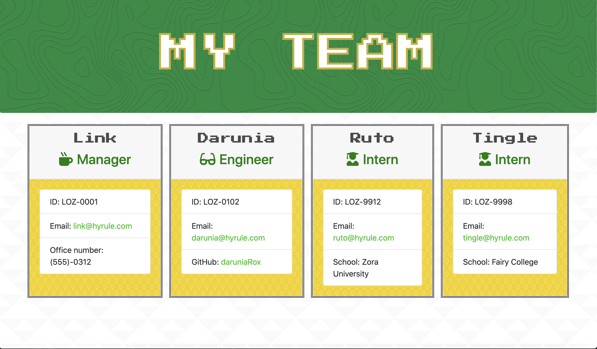
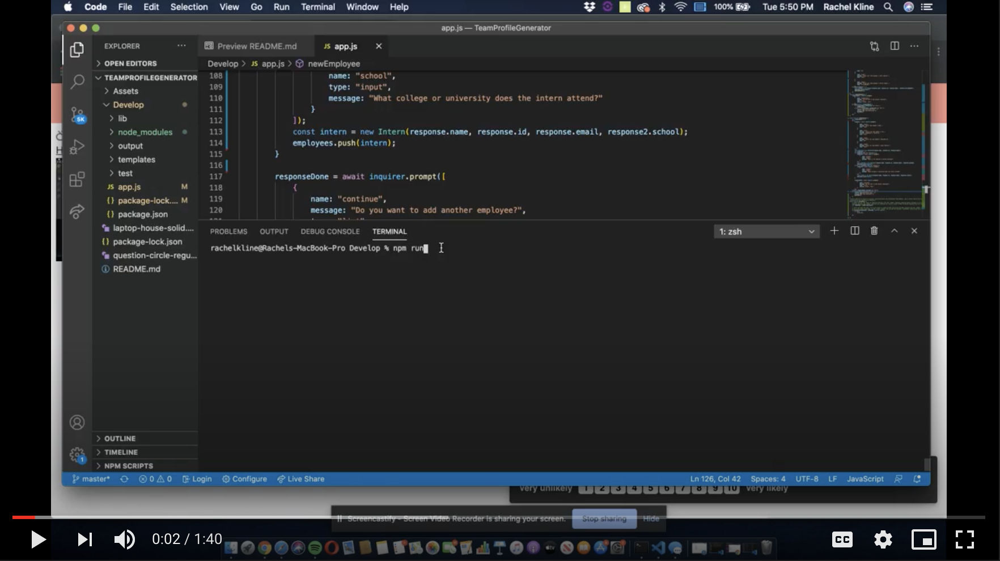

# TeamProfileGenerator

## Application Output Example

 ---
## Description

  *The what, why, and how:*

  In this assignment, we were tasked with building a software engineering team generator comand line application using the Inquirer package. The user can input any number of team members, and they may be a mix of engineers and interns. The assignment must also pass all unit tests. When the user has completed building the team, the application will then create an HTML file that displays a nicely formatted team roster based on the user-provided information.

  The employees are generated using a standard "Employee" class, then based on the user-input, they are then classified as either a Manager, Engineer, or Intern. Depending on the job title chosen, different questions will be prompted and appended to the HTML file.
  
  We were given free-reign for styling. In my example, I used my favorite video game characters (from the Legend of Zelda) and decided to build my color-schemes and fonts around that game!

  ---

## Video Tutorial

Click the play button to be redirected to the video tutorial.

 

  ---
## Table of Contents

  - [Applicaton Output Example](#application-output-example)
  - [Description](#description)
  - [Video Tutorial](#video-tutorial)
  - [Usage](#usage)
  - [Questions](#questions)
 
 ---

## Usage
  *Instructions and examples for use:*

Download the inquirer package in order to run this application using npm install. Then, run the tests using npm run test to ensure that they all pass. This is crucial to the execution of the final HTML file.
  
---

## Questions?

  *For any questions about this application, please contact me via the information below:*

  GitHub: https://github.com/users/rachelkline
  
  Email: rachel_kline@icloud.com

---
   

  [Icons provided by https://fontawesome.com/]